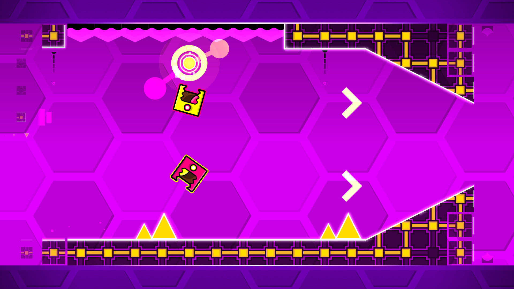
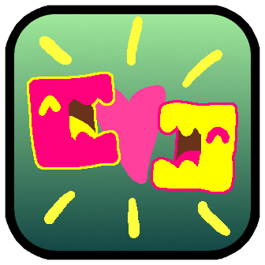

# Minus One Glow Toggle

Adds a button to the Icon Kit that sets your glow to -1. This causes the behavior of the player's glow to revert to pre-2.2 behavior, matching the secondary color of the player and changing accordingly for duals. This behavior will persist even after you uninstall the mod until you change your glow color back.

Example:


This does not fully emulate 2.1 glow behavior, only the color set. You can emulate 2.1 glow behavior by using -1 glow in tandem with [Blending Glow by NinKaz](mod:ninkaz.blending_glow)

As for now this mod will not be pushed to the Geode index as I do not feel satisfied with the implementation and am not experienced enough with creating mods to figure out how to integrate this button into the game more cleanly, but I'm releasing it regardless as it's still useful.



## Build instructions
For more info, see [our docs](https://docs.geode-sdk.org/getting-started/create-mod#build)
```sh
# Assuming you have the Geode CLI set up already
geode build
```